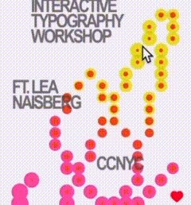

# 9103.shiyi.yshi0114
Creative coding major project
Interaction Explanation:
This work responds to user interaction in two ways: the color dynamically shifts in response to mouse movement, and pressing the spacebar triggers a random color flickering effect across the entire composition.

Detailed Explanation of My Personal Approach:

I chose to use user input as the main form of interaction, combining both mouse movement and keyboard input to drive the animation. Within our group animation project, I focused particularly on expressing color variation as a core visual element. When the user moves the mouse or presses the spacebar, the colors of the work change dynamically, creating a responsive visual experience.

My inspiration came from a small interactive piece I saw on Instagram. In the video, a small circle changes color in response to the mouse’s movement. This sparked the idea of applying a similar effect to lines, using mouse interaction to trigger color changes, which I then developed further in my own way.

