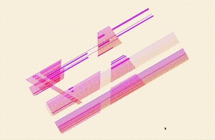
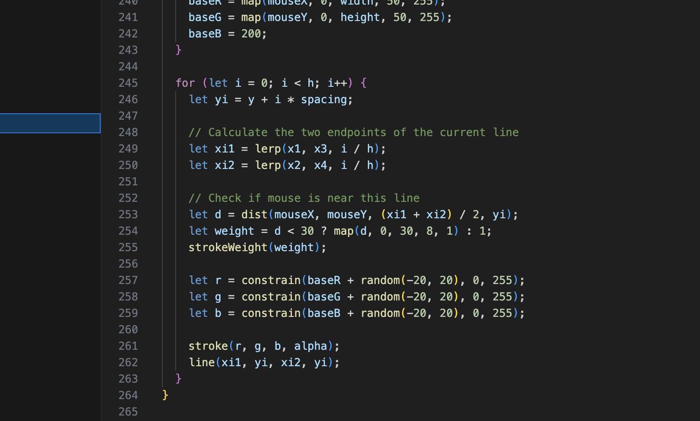
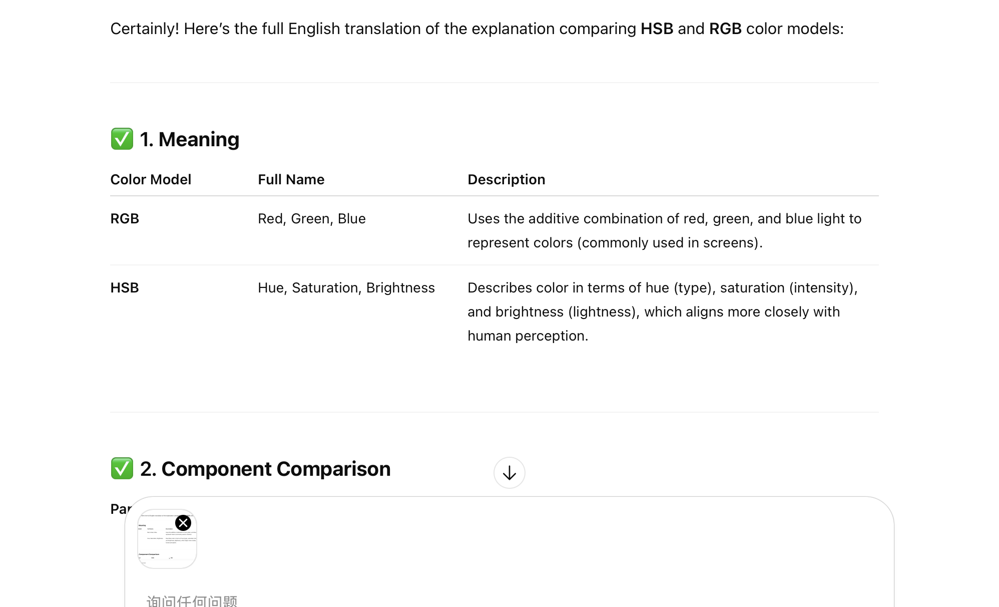

# 🌀 User Input – Responsive Animation Based on Nasreen Mohamedi's Artwork

# 9103.shiyi.yshi0114

## 🎨 Creative Coding Major Project

shiyi yshi0114  530831042

### 🔁 Interaction Explanation

This work responds to user interaction in two ways:  
1. The color dynamically shifts in response to mouse movement.  
2. Pressing the spacebar triggers a random color flickering effect across the entire composition.

### 🎞️ Preview of Animation

  
  

---

### ✏️ Detailed Explanation of My Personal Approach

I chose to use user input as the main form of interaction, combining both mouse movement and keyboard input to drive the animation. Within our group animation project, I focused particularly on expressing color variation as a core visual element. When the user moves the mouse or presses the spacebar, the colors of the work change dynamically, creating a responsive visual experience.

My inspiration came from a small interactive piece I saw on Instagram. In the video, a small circle changes color in response to the mouse’s movement. This sparked the idea of applying a similar effect to lines, using mouse interaction to trigger color changes, which I then developed further in my own way.

  

---

### ⚙️ Technical Description

- 🎨 **Color Mode Switch**: Switched from RGB to HSB color mode to gain smoother and more expressive hue control. This allowed dynamic mapping of hue based on `mouseX`, and variation with `mouseY`.
- ⌨️ **Interactive Input**: `mouseX`, `mouseY`, and the spacebar are used to control color and toggle between controlled and random hue modes.
- 📐 **Line and Trapezoid Drawing**: Custom functions `drawLinGroup()` and `drawTrapezoidLines()` were developed to create layered, scalable structures with fine control over spacing, length, and color.
- 🔁 **Modular Composition**: Used `push()`/`pop()` to isolate transformations for each visual element, enabling easy scaling, rotating, and positioning.
- 🧭 **Responsive Canvas**: Used `scaleFactor` and `resizeCanvas()` to ensure layout adapts smoothly to different window sizes and maintains aspect ratio across devices.

Building upon the group’s original codebase, I focused on implementing color variation without altering the core structure of the group’s code.  
Initially, I experimented with a random color variation method introduced in Week 6, but the resulting colors appeared too light and caused unwanted visual jitter.

To resolve this, I consulted AI tools and received suggestions for improvement. I eventually switched from the RGB color mode to HSB, based on a new solution provided by ChatGPT.  

This adjustment successfully addressed the issue of insufficient color saturation.

---

## 🤖 AI Assistance Statement

During the development of this project, I consulted ChatGPT for support with color theory and code conversion.  
The AI suggestions helped me refine the color behavior and improve the overall structure of the code.  
All creative decisions and final implementations were made by me.

---